# Social Media WebApp

Welcome to the Social Media App project! This project is a full-featured social media application built using FastAPI for the backend and JavaScript for the frontend. The app allows users to create profiles, post updates, connect with friends, and chat in real-time.

## Table of Contents

- [Features](#features)
- [Usage](#usage)
- [API Endpoints](#api-endpoints)
- [Database](#Database)
- [Technologies Used](#technologies-used)
- [Contributing](#contributing)

## Features

### **User Authentication and Authorization**

- **Registration:**  
  Users can sign up by providing their **name**, **email**, and **password**. Once registered, they can log in securely using their email and password.  

- **Login Process:**  
  The login process is managed using a **JWT (JSON Web Token)** system for secure authentication. The token expiration time is variable and can be configured via the `ACCESS_TOKEN_EXPIRE_MINUTES` variable in the `.env` file.  

- **Token Expiry:**  
  If the token expires, users are automatically redirected to the login page, where they can log in again to refresh their session with a new token.  

- **Visual Clarification:**  
  The following screenshots provide a clearer understanding of the user authentication flow. 

  - **Login** 

  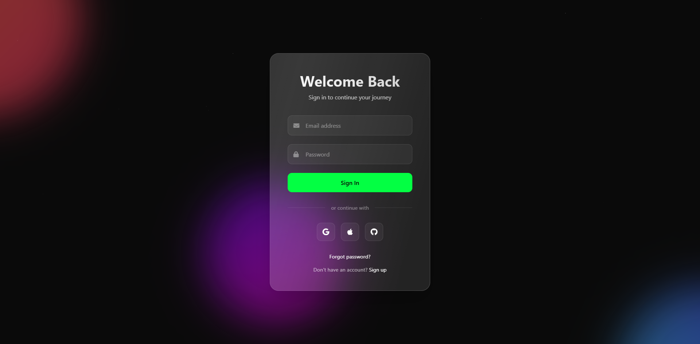
  - **Signup**

  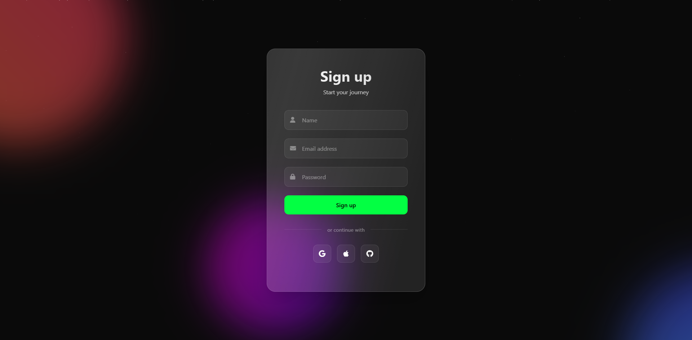


- **Profile creation and management**  
  - **Automatic Account Creation:**  
  Upon registration, the app automatically creates a user account using the information provided, including **name**, **email**, and **password**.  

  - **Profile Limitations at Registration:**  
    During registration, users are not able to add profile photos, background images, or any additional details. These features are available after successful login.  

  - **Profile Updates:**  
    After logging in, users can update their profile with the following details:  
    - **Introduction** (A short bio or about section)  
    - **Contact Numbers**  
    - **Birthday**  
    - **Address**  
    - **Social Media Links** (Links to profiles on platforms like Twitter, LinkedIn, etc.)  

  - **Profile page**
  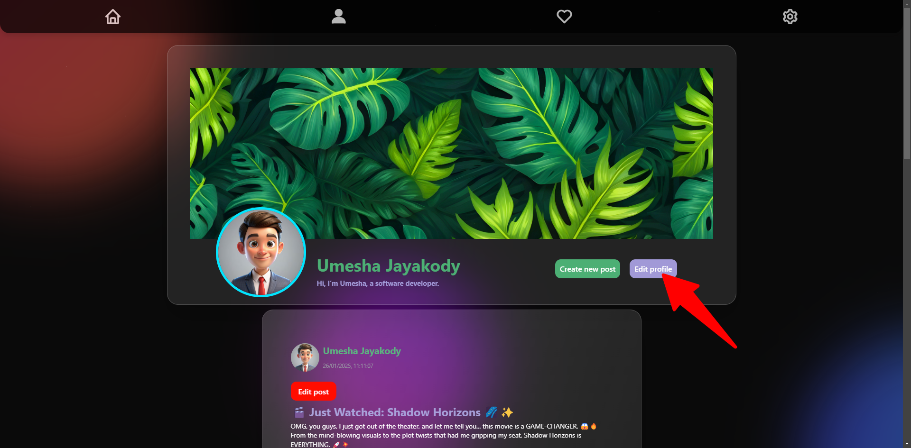

  - **Add more details**
  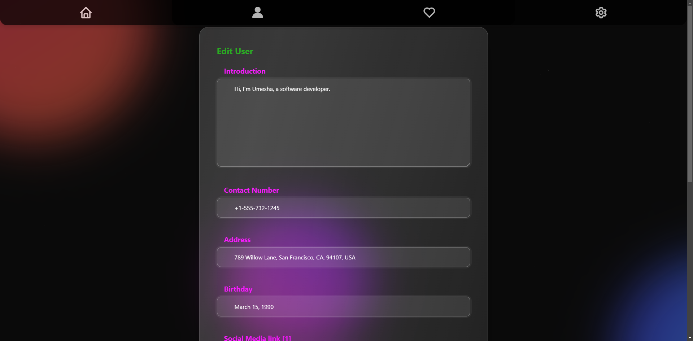
  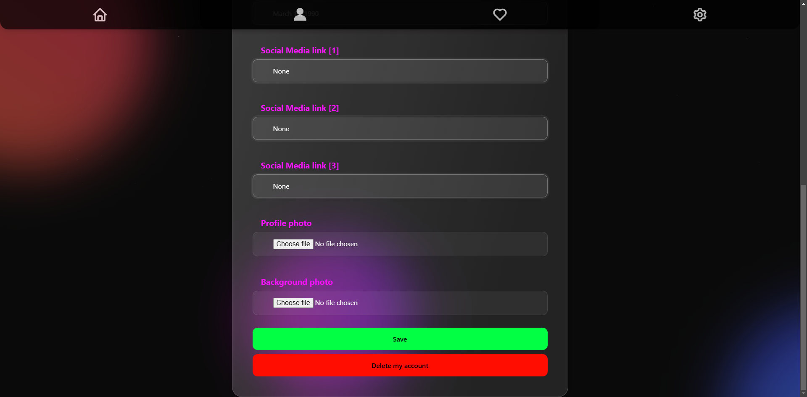


  - **Privacy Settings:**  
    These profile details are kept **hidden** until both users have mutually followed each other. This ensures privacy and control over the information shared.  

  - **Others profiles - when not followed**

  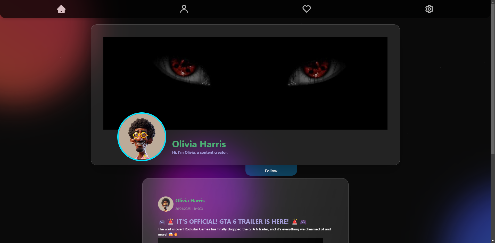

  - **Others profiles - when followed eachother**

  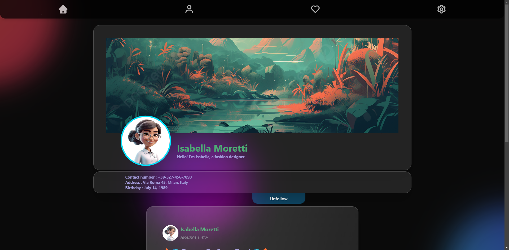


- **Posting updates with text and media**  
  - **Creating Posts:**  
  After registration, users can create and share posts that include:  
  1. **Title**  
  2. **Content** (text-based)  
  3. **Alternative Content** (optional: image or video to accompany the post)  

  - **Create Post**

  

  - **Post Editing:**  
    Users can edit their posts at any time, allowing for continuous updates and modifications.
  
  - **Edit Post**

  

  - **Engagement with Posts:**  
    Users and their friends can interact with posts in the following ways:  
    - **Like/Unlike Posts**: Show appreciation or remove likes on a post.  
    - **Comment on Posts**: Share thoughts, feedback, or discussions related to the post.  
    - **View Comments**: Users can view all comments made on the posts for an engaging experience.

  - **Like & Comment**

  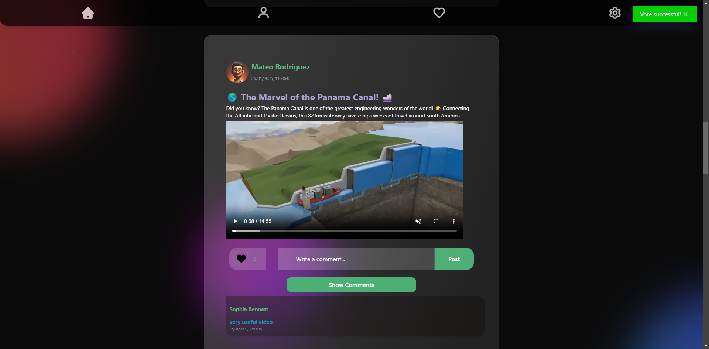

  - **Post Visibility:**  
    - Users will see their own posts directly on their **profile** page.  
    - The **home page** displays posts from all users, allowing for a broader view of the platform's content.

  - **Profile Interaction:**  
    - Users have the ability to visit other profiles and engage with their content.  
    - **Follow/Unfollow** functionality allows users to build their network and stay updated on the posts from profiles they’re interested in.

### **Friend Connections and Friend List Management**

- **Follow/Unfollow Users:**  
  Users have the ability to **follow** and **unfollow** other users, enabling dynamic connections within the platform.

- **Mutual Following for Chat Access:**  
  Once two users **mutually follow** each other, they gain the ability to engage in direct **chat** with one another, enhancing interaction and communication.

### **Real-Time Chat Functionality**

- **Instant Messaging:**  
  The chat feature allows for **real-time communication**, ensuring that messages are delivered and received instantly.  
  *Note: The chat system is currently **not optimized** for performance and may have room for future improvements in speed and responsiveness.*

- **Chat**

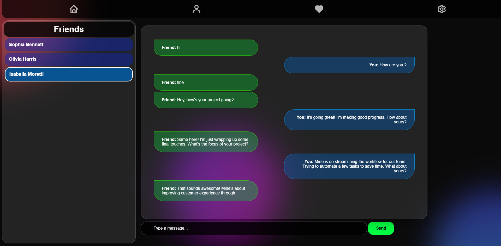

### **Responsive Design for Mobile and Desktop**

- **Current Design:**  
  The platform is designed with a focus on **desktop users** for now, ensuring an optimal experience on larger screens.

### Prerequisites

- Python 3.8+  
- Node.js and npm  
- MySQL (or any other preferred database)  

**Python dependencies:**  
```plaintext
alembic==1.14.0
annotated-types==0.7.0
anyio==4.7.0
argon2-cffi==23.1.0
argon2-cffi-bindings==21.2.0
bcrypt==3.2.0
certifi==2024.12.14
cffi==1.17.1
click==8.1.8
colorama==0.4.6
cryptography==44.0.0
dnspython==2.7.0
ecdsa==0.19.0
email_validator==2.2.0
fastapi==0.115.6
fastapi-cli==0.0.7
greenlet==3.1.1
h11==0.14.0
httpcore==1.0.7
httptools==0.6.4
httpx==0.28.1
idna==3.10
itsdangerous==2.2.0
Jinja2==3.1.5
Mako==1.3.8
markdown-it-py==3.0.0
MarkupSafe==3.0.2
mdurl==0.1.2
mysql-connector-python==9.1.0
orjson==3.10.12
passlib==1.7.4
pyasn1==0.6.1
pycparser==2.22
pydantic==2.10.4
pydantic-extra-types==2.10.1
pydantic-settings==2.7.0
pydantic_core==2.27.2
Pygments==2.18.0
python-dotenv==1.0.1
python-jose==3.3.0
python-multipart==0.0.20
PyYAML==6.0.2
rich==13.9.4
rich-toolkit==0.12.0
rsa==4.9
shellingham==1.5.4
six==1.17.0
sniffio==1.3.1
SQLAlchemy==2.0.36
starlette==0.41.3
typer==0.15.1
typing_extensions==4.12.2
ujson==5.10.0
uvicorn==0.34.0
watchfiles==1.0.3
websockets==14.1
```

### Backend Setup

1. Clone the repository:  
    ```bash
    git clone https://github.com/yourusername/social-media-app.git
    cd social-media-app
    ```  

2. Create a virtual environment and activate it:  
    ```bash
    python -m venv venv
    source venv/bin/activate  # On Windows, use `venv\Scripts\activate`
    ```  

3. Install the required dependencies:  
    ```bash
    pip install -r requirements.txt
    ```  

4. Set up the database and apply migrations:  
    ```bash
    alembic upgrade head
    ```  

5. Run the FastAPI server:  
    ```bash
    uvicorn main:app --reload
    ```  

## Usage

1. Start the backend server:  
    ```bash
    uvicorn main:app --reload
    ```  

2. Open your browser and navigate to `http://127.0.0.1:5501/static/login.html` to access the application.  

## Database  

The database consists of 7 tables designed to efficiently store and manage data for the application. Below is the detailed schema, including the relationships between the tables. Please refer to the diagram below for a visual representation of the structure and how each table is interconnected.
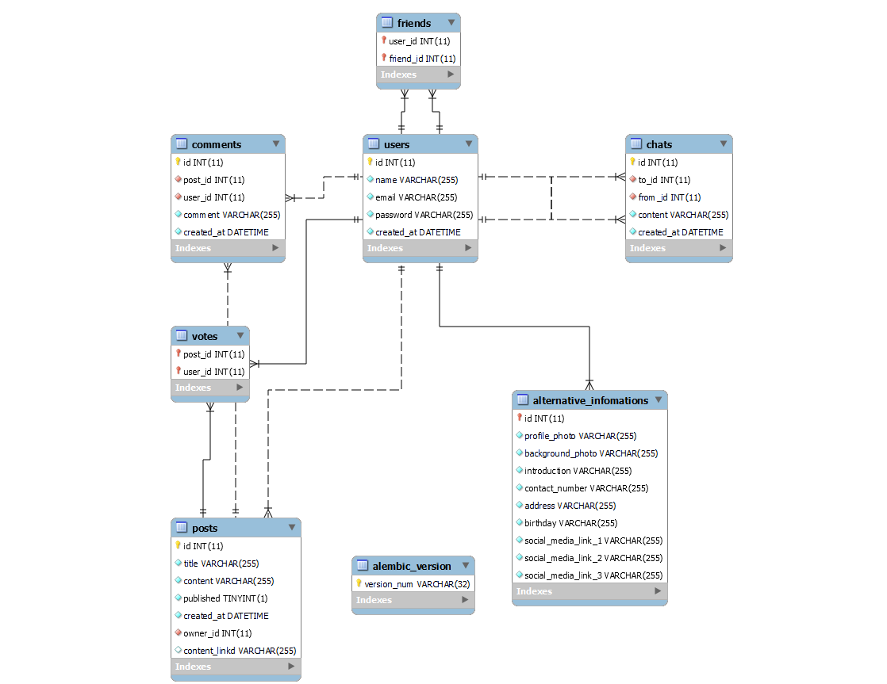

## API Endpoints  

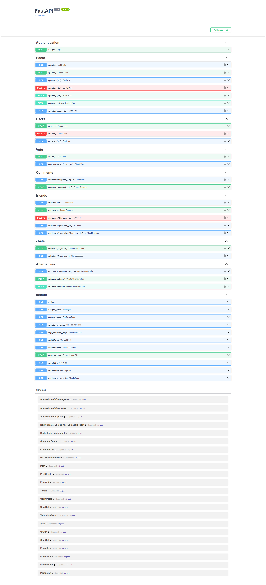

## Technologies Used  

- **Backend**: FastAPI, SQLAlchemy, Alembic  
- **Frontend**: HTML, CSS, JavaScript  
- **Database**: MySQL  
- **Authentication**: JWT (JSON Web Tokens)  
- **Real-time Communication**: WebSockets  

## Contributing  

This is an individual project developed to demonstrate key functionality and features. However, contributions are highly welcome and appreciated! If you'd like to contribute, please follow the steps below:

Fork the repository: Create a personal copy of the repository.
Create a pull request: Submit a pull request with your proposed changes.
Code Style: Ensure that your code adheres to the established coding standards and style guidelines.
Testing: Include appropriate tests for any new features or bug fixes to ensure code quality and functionality.
Your contributions help improve this project, and we appreciate your effort in making it better!